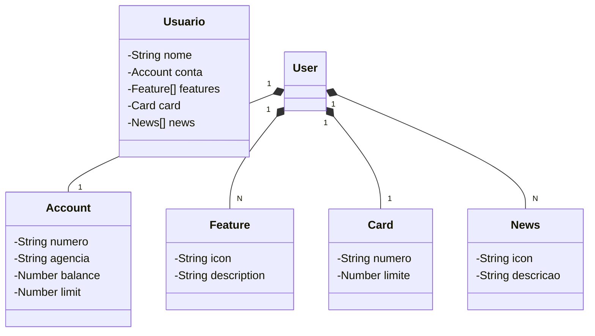

# Santander Dev Week 2023

## Diagrama de Classes (Domínio da API)

```mermaid
classDiagram
  class Usuario {
    -String nome
    -Account conta
    -Feature[] features
    -Card card
    -News[] news
  }

  class Account {
    -String numero
    -String agencia
    -Number balance
    -Number limit
  }

  class Feature {
    -String icon
    -String description
  }

  class Card {
    -String numero
    -Number limite
  }

  class News {
    -String icon
    -String descricao
  }

  User "1" *-- "1" Account
  User "1" *-- "N" Feature
  User "1" *-- "1" Card
  User "1" *-- "N" News
```

