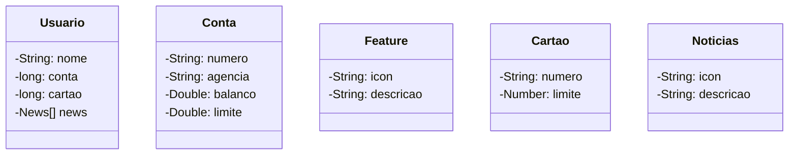

# Santander Dev Week 2023


## Diagrama de Classes (Domínio da API)


```mermaid
classDiagram
  class Usuario {
    -String: nome
    -long: conta
    -long: cartao
    -News[] news
  }

  class Conta {
    -String: numero
    -String: agencia
    -Double: balanco
    -Double: limite
  }

  class Feature {
    -String: icon
    -String: descricao
  }

  class Cartao {
    -String: numero
    -Number: limite
  }

  class Noticias {
    -String: icon
    -String: descricao
  }
```

  User "1" *-- "1" Conta
  User "1" *-- "N" Feature
  User "1" *-- "1" Cartao
  User "1" *-- "N" News
```


